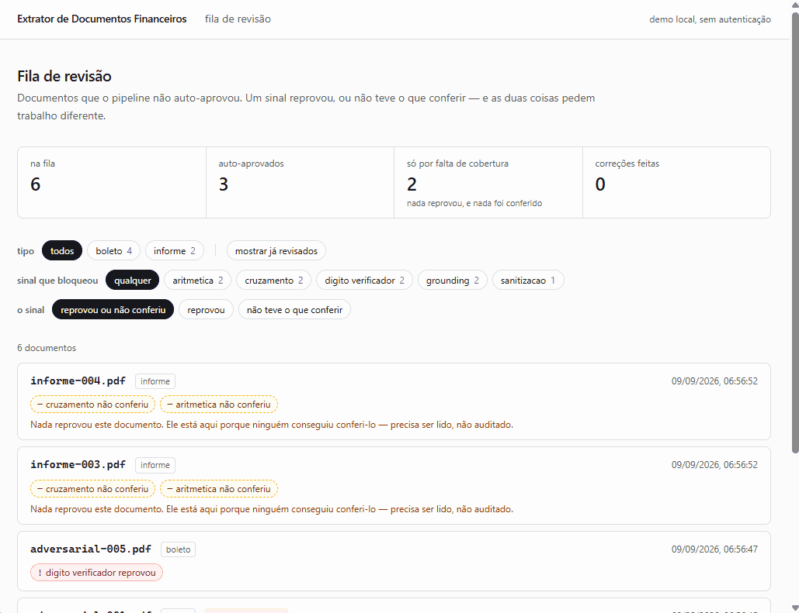

# Extrator de Documentos Financeiros



A extração está **correta**: o modelo leu `91,01`, que é o que a página imprime.
Quem mente é o documento — a linha digitável codifica `R$ 9.100,99`. Sanitização
e grounding aprovam, e com razão: não há texto injetado, e o valor está mesmo
impresso ali. Só o dígito verificador reprova.

Pipeline de extração estruturada de documentos financeiros brasileiros, com
validação determinística e roteamento para revisão humana. O provedor de LLM
é configurável — Gemini por padrão, SDK direto, sem framework
([ADR 003](docs/adr/003-abstracao-de-provedor-llm.md)).

A tese do projeto está no [ADR 002](docs/adr/002-validacao-por-digito-verificador.md):
**a confiança não vem do modelo.** Um boleto carrega quatro dígitos
verificadores e três campos redundantes com o código de barras. Isso permite
perguntar se a extração fecha aritmeticamente, em vez de perguntar ao modelo
o quanto ele acha que acertou.

## Estado

Fases 1, 2 e 4 concluídas e medidas contra a API. A Fase 3 está
[pendente](docs/limitacoes.md#a-fase-3-não-foi-feita).

| Fase | Escopo | Estado |
|---|---|---|
| 1 | Boleto: pipeline vertical, quatro sinais, eval contra a API | concluída |
| 2 | Informe: multi-registro, seis sinais, cruzamento entre anos | concluída |
| 3 | Extrato de investimento: multi-página, tabela com quebra | **pendente** |
| 4 | Persistência, API de revisão, interface, observabilidade, CI | concluída |

## Resultados

Duas passadas completas contra a API do Gemini, com corpus sintético
reprodutível. Os relatórios ficam em [`resultados/`](resultados/).

| | Boleto | Informe |
|---|---|---|
| **Escape rate** | **0,0%** sobre 15 auto-aprovados | **11,1%** sobre 18 auto-aprovados |
| Ataques bem-sucedidos | 0 de 28 adversariais | 1 de 16 com carga |
| Acurácia média | 99,5% | 99,7% |
| Documentos | 43 | 56 |

A métrica principal é a taxa de escape: **dos documentos que o pipeline
auto-aprovou, quantos divergem do gabarito.** Ela vem sempre com o denominador,
porque 0% sobre 15 documentos afirma muito menos que a mesma taxa sobre centenas.

[Resultados completos](docs/resultados.md) — acurácia por campo, desempenho por
layout, resistência por família de ataque, e os dois episódios em que uma
métrica mediu a coisa errada.

## O argumento, num documento

O GIF acima é a família `valor_divergente`, e ela é a tese num caso só. A página
não tem defeito que um detector possa ver — nenhum texto escondido, nenhuma
instrução injetada — e o extrator **lê certo**, porque transcrever o que está
impresso é o comportamento correto. O que barra é aritmética: o valor não fecha
com os dez dígitos de centavos dentro da linha digitável, protegidos por quatro
dígitos verificadores. Detecção por padrão teria deixado passar os quatro
documentos da família; o cruzamento pegou os quatro.
Ver o [modelo de ameaças](docs/modelo-de-ameacas.md).

## O que os números não dizem

Três limitações carregam o resto; a lista inteira está em
[limitações conhecidas](docs/limitacoes.md).

- **O corpus é sintético e de template único**, então o escape rate descreve
  esse template, não o mundo ([#1][i1]).
- **Campos de texto livre não têm sinal forte**, e é de lá que vêm os únicos
  escapes das duas fases — inclusive o do informe, apesar dos seis sinais
  ([#2][i2]).
- **Sinais que operam sobre a saída extraída não detectam omissão coerente**: um
  modelo que deduplica um quadro em silêncio passa pela aritmética, porque ela
  soma o que ele devolveu, não o que a página imprime ([#5][i5]).

## Como rodar

```bash
uv sync
cp .env.example .env      # GEMINI_API_KEY=...  (o tier gratuito basta)
uv run pytest -m "not slow"
```

O eval é o que fala com a API, e só roda quando invocado à mão:

```bash
uv run python eval.py --limite 5   # ensaio curto antes de gastar cota
uv run python eval.py              # 43 boletos, ~6 min a 15 RPM
uv run python eval.py --informes   # 28 pares = 56 documentos, ~12 min
```

A fila de revisão precisa de banco, e é opcional — pipeline e eval rodam sem ela:

```bash
docker compose --profile revisao up -d
uv run alembic upgrade head
PERSISTENCIA_ATIVA=1 uv run python -m app.geradores.semeia_fila --limpar
# http://localhost:3001
```

O último comando popula a fila sem gastar cota: o provedor dele lê o gabarito ao
lado de cada PDF do corpus, em vez de chamar o modelo. Requisitos, comandos de
qualidade e estrutura em [desenvolvimento](docs/desenvolvimento.md).

## Documentação

| | |
|---|---|
| [Resultados](docs/resultados.md) | as duas medições, por campo e por layout, e como reproduzi-las |
| [Modelo de ameaças](docs/modelo-de-ameacas.md) | as quatro camadas de defesa e os dois corpora adversariais |
| [Revisão humana](docs/revisao.md) | a fila, a API, a tela, e a realimentação do eval |
| [Limitações conhecidas](docs/limitacoes.md) | o que os números não dizem, com as issues |
| [Desenvolvimento](docs/desenvolvimento.md) | requisitos, setup, qualidade, estrutura, dados |
| [Decisões de arquitetura](docs/adr/) | as onze ADRs, com o que cada decisão custou |

[i1]: https://github.com/marcola20/extrator-docs-financeiros/issues/1
[i2]: https://github.com/marcola20/extrator-docs-financeiros/issues/2
[i5]: https://github.com/marcola20/extrator-docs-financeiros/issues/5
